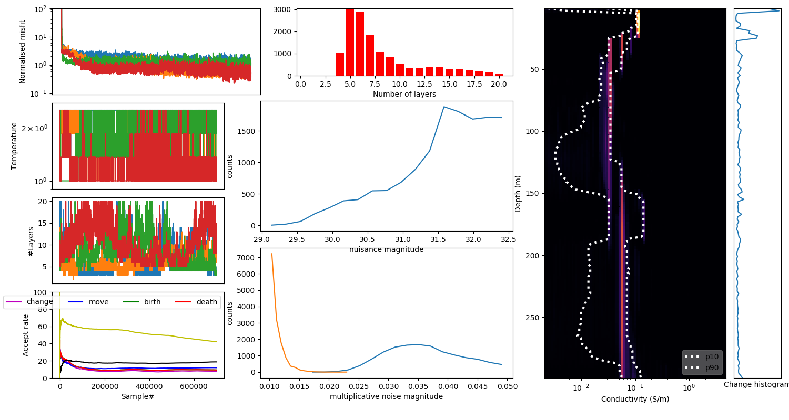
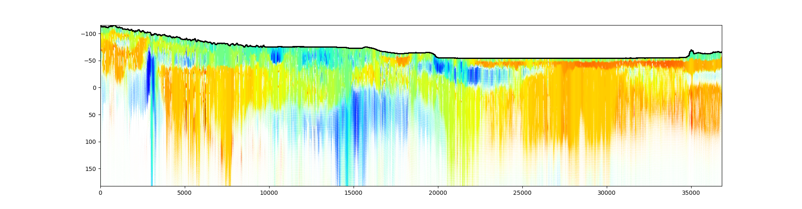
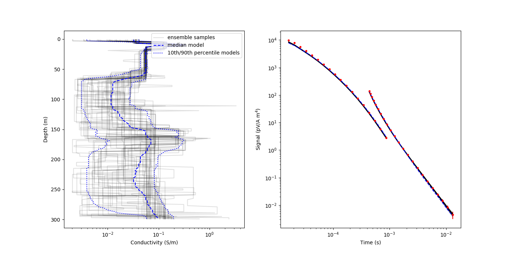

## GAAEMTools

Package to enable integration of forward modelling functionality in GA-AEM with Julia, as well as plotting tools for visualising inversion outputs.

### Installation

This package requires Julia 1.3.x or earlier due to its dependence on [Cxx.jl](https://github.com/JuliaInterop/Cxx.jl/) which does not yet support Julia 1.4+.

Only Linux is supported currently. Installation was tested on CentOS 6.10 using Julia 1.3.1 and gcc 4.4.7, as well as Ubuntu 20.04 using Julia 1.3.1 and gcc 9.3.0.

Ensure submodules are pulled first. Assuming you have cloned the ga-aem git repository to your home directory:
```bash script
>> cd ~/ga-aem 
>> git submodule init 
>> git submodule update 
>> git submodule status 
```

Then enter the `julia` subdirectory of the git repository and start julia. To install the package, enter the `pkg` REPL using `]` and type:
```
(v1.3) pkg> dev GAAEMTools/
```
The installation will compile a shared library that exposes the forward modelling functionality from GA-AEM to Julia. Because this compilation step depends on C++ source files from GA-AEM, currently this Julia package can only be installed in development mode from its subdirectory within the GA-AEM repository, and cannot be distributed independently of GA-AEM itself.

#### For NCI VDI users
Before running for the first time ensure to set the environment variable CXXJL_ROOTDIR=/path/to/gcc/version

### Usage

After running the installation step above, you can load GAAEMTools in a Julia script or at the REPL by typing:
```julia
using GAAEMTools
```

#### Forward modelling
Forward modelling in GAAEMTools requires you to create a "geometry" object, which stores key parameters of the AEM system you are trying to model. This object is instantiated as:
```julia
GAAEMTools.Geometry(;ztxLM = 35.0, ztxHM = 35.0, rrx = -17.0, dztxLM = 2.0, dztxHM = 0.2)
```
All arguments are optional keyword arguments, with defaults as specified. `ztxLM` and `ztxHM` are the heights above ground for low and high-moment transmitters respectively, `rrx` is the horizontal distance between transmitter and receiver, and `dztxLM` and `dztxHM` are vertical transmitter-receiver distances for low and high moment systems respectively. Note that `ztxLM > 0 && ztxHM > 0 && rrx < 0 && dztxLM < 0 && dztxHM < 0`.

Once you have created a `Geometry`, you can pass it, along with conductivity and thickness of a layered-earth model and STM files describing other parameters of your AEM system, to the `forward_model` function. For example, if I am modelling a SkyTEM system described by STM files `SkyTEM-LM.stm` and `SkyTEM-HM.stm`:

```julia
g = GAAEMTools.Geometry(ztxLM = 30.0, ztxHM = 30.0, rrx = -15.0, dztxLM = 2.0, dztxHM = 0.2);
lmstm = "Skytem-LM.stm";
hmstm = "Skytem-HM.stm";
cond = [0.01, 1.0, 0.01];
thick = [50.0, 50.0];
forward_data = GAAEMTools.forward_model(g, cond, thick; lmstm = lmstm, hmstm = hmstm)
```
The returned array `forward_data` is a (number of gates * 2) array. The first column is the forward modelled response and the second column is the geometric centre of each gate time window. The units of response and time are specified by the STM file.
Note that the conductivity and thickness arrays must contain `Float64` numbers because the underlying C++ code expects `double` arguments - an array of integers will throw an error.


#### Plotting inversion outputs
GAAEMTools supports a few kinds of plots for visualising the output of Bayesian inversions from GA-AEM.

Firstly, you can read and plot pmaps (conductivity-depth histograms) of inversion posteriors for individual soundings. This is done for a netCDF inversion output `ncfile` using:
```julia
P = GAAEMTools.read_rjmcmc_pmap(ncfile);
GAAEMTools.view_rjmcmc_pmap(P)
```
`read_rjmcmc_pmap` reads relevant variables into a `GAAEMTools.Pmap` data structure, so you can do your own analysis if you wish or incorporate the pmap into other types of plots. `view_rjmcmc_pmap` produces a pre-cooked visualisation of the pmap, including histograms of nuisance parameters and multiplicative noise magnitude if they were inverted for, as well as various convergence/sampling statistics:


GAAEMTools also provides rudimentary section plotting functionality. If you have a directory of netCDFs `ncdir` corresponding to soundings along an AEM flight line, you can plot the median conductivity of this section:
```julia
x,y,z,dz,nuisance_histogram = GAAEMTools.section_arrays(ncdir);
GAAEMTools.plot_section(x,y,z,dz)
```

The colour of the section scales from blue to red as median conductivity increases (the `jet` colourmap). The colours are alpha-blended with white (made paler) as the spread between the 10th and 90th percentile of the posterior conductivity increases, as a way of visually communicating uncertainty in the section. The bounds of the alpha blending can be adjusted with the keyword arguments `lb_dz` and `ub_dz`.

`section_arrays` also returns histograms of nuisances along the line which can be plotted separately, and `plot_section` can be passed an `ax` argument if the section should be plotted on an existing set of PyPlot axes.

Lastly, you can create a _swarm plot_, which draws a small number of individual conductivity-thickness models from the posterior ensemble and plots these models, as well as their forward response compared with the actual data given to the inversion. Note that this kind of plotting requires `SaveModels = Yes` to be set in the Sampler section of the .con file used for the inversion.

You can produce a swarm plot using the function
```julia
GAAEMTools.plot_swarm(ncfile::String, lmstm::String, hmstm::String)
```
Because the swarm plot models the forward response of the ensemble samples, you must provide this function with low-moment and high-moment STM files to define parameters of the AEM system being modelled.

The swarm plot looks like this:

